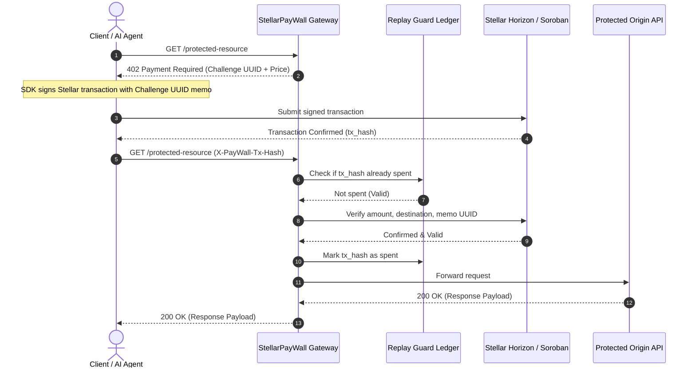

# StellarPayWall

<p align="center">
  <strong>High-Throughput HTTP 402 Stellar Micropayment Gateway & Middleware for API Monetization and Autonomous Agent Commerce.</strong>
</p>

<p align="center">
  <a href="https://stellarpaywall.onrender.com/"></a>
  <a href="https://github.com/HassanKorey/StellarPayWall/actions/workflows/ci.yml"></a>
  <a href="LICENSE"></a>
  <a href="https://www.python.org/"></a>
  <a href="https://soroban.stellar.org/"></a>
</p>

---

## ⚡ Live Deployment

| Service | Endpoint | Description |
| :--- | :--- | :--- |
| **Merchant Dashboard** | [stellarpaywall.onrender.com/](https://stellarpaywall.onrender.com/) | Live merchant analytics & transaction monitor |
| **Interactive API Docs** | [stellarpaywall.onrender.com/docs](https://stellarpaywall.onrender.com/docs) | OpenAPI / Swagger interactive documentation |
| **Health Check** | [stellarpaywall.onrender.com/health](https://stellarpaywall.onrender.com/health) | Uptime & container probe (`{"status":"ok"}`) |
| **Protected Demo (HTTP 402)** | [stellarpaywall.onrender.com/protected-resource](https://stellarpaywall.onrender.com/protected-resource) | Live HTTP 402 payment challenge endpoint |

### Test via cURL

```bash
curl -i https://stellarpaywall.onrender.com/protected-resource
```
```http
HTTP/2 402 Payment Required
www-authenticate: Stellar asset="XLM", amount="0.05", destination="merchant_address", challenge="<UUID>"
x-paywall-amount: 0.05
x-paywall-asset: XLM
x-paywall-destination: merchant_address
x-paywall-challenge-uuid: <UUID>

{"detail":"Payment Required"}
```

---

## ✨ Features

- **HTTP 402 Standard**: Native Web standard payment challenges via `WWW-Authenticate` and `X-PayWall-*` headers.
- **Near-Zero Transaction Fees**: Powered by Stellar (10 Stroops / 0.00001 XLM per payment operation).
- **Sub-5-Second Settlement**: Instant on-chain confirmation via Stellar Horizon and Soroban RPC.
- **Soroban Smart Contract Vault**: On-chain payment escrow & SAC token verification ([`contracts/paywall_vault`](contracts/paywall_vault)).
- **Anti-Replay Protection**: Challenge UUID memo binding with SQLite/Redis atomic double-spend prevention.
- **Turnkey Client SDKs**: Transparent auto-payment interceptors for Python and TypeScript.

---

## 🔄 Protocol Flow



---

## 🚀 Quickstart

### 1. Installation

```bash
git clone https://github.com/HassanKorey/StellarPayWall.git
cd StellarPayWall
python3 -m venv venv
source venv/bin/activate
pip install -r requirements.txt
```

### 2. Start Gateway Server

```bash
uvicorn stellarpaywall.main:app --reload --port 8000
```
Open [http://localhost:8000/docs](http://localhost:8000/docs) for the Swagger UI or [http://localhost:8000/](http://localhost:8000/) for the merchant dashboard.

### 3. Run Test Suite

```bash
# Gateway & Security Vector Tests
pytest tests/ -v

# Soroban Smart Contract Tests
cd contracts/paywall_vault && cargo test && cd ../..
```

---

## 📦 SDK Integration

Client SDKs automatically intercept `402 Payment Required`, sign the Stellar transaction with the challenge UUID, and retry the request transparently.

### Python

```python
from stellarpaywall_sdk import StellarPaywallClient

client = StellarPaywallClient(
    base_url="https://stellarpaywall.onrender.com",
    secret_key="S...",  # Payer Stellar Secret Key
    horizon_url="https://horizon-testnet.stellar.org"
)

# Automatically handles 402 challenge, signs transaction, and retries:
response = client.get("/protected-resource")
print(response.json())
```

### TypeScript / JavaScript

```typescript
import { StellarPaywallClient } from "stellarpaywall-sdk";

const client = new StellarPaywallClient({
  baseUrl: "https://stellarpaywall.onrender.com",
  secretKey: "S...",
  horizonUrl: "https://horizon-testnet.stellar.org"
});

const res = await client.fetch("/protected-resource");
const data = await res.json();
console.log(data);
```

---

## 🔐 Soroban Smart Contract (`PaywallVault`)

Located in [`contracts/paywall_vault/`](contracts/paywall_vault/):

- `initialize(admin, token)`: Sets contract administrator and payment asset address (e.g. SAC USDC or XLM).
- `pay_for_resource(payer, request_id, amount)`: Transfers funds into vault, records payment by request UUID, and emits `PaymentVerified` event.
- `claim_merchant_balance(merchant, amount)`: Allows merchant to withdraw accumulated earnings.
- `get_payment_status(request_id)`: Queries payment status on-chain.

---

## 📡 API Reference & Headers

### HTTP 402 Challenge Headers

| Header | Description | Example |
| :--- | :--- | :--- |
| `WWW-Authenticate` | Standard challenge string | `Stellar asset="XLM", amount="0.05", challenge="..."` |
| `X-PayWall-Amount` | Required payment amount | `0.05` |
| `X-PayWall-Asset` | Required asset code | `XLM` |
| `X-PayWall-Destination`| Merchant public address | `G...` |
| `X-PayWall-Challenge-UUID` | Unique challenge UUID | `234de163-1869-4b24-8d90-45e171d9e66c` |

### Payment Submission Headers

| Header | Description |
| :--- | :--- |
| `X-PayWall-Tx-Hash` | Stellar transaction hash paying the merchant |
| `X-PayWall-Challenge-UUID` | Challenge UUID matching the transaction memo |

---

## 🤝 Contributing

Contributions are welcome! Please review [CONTRIBUTING.md](CONTRIBUTING.md) for development workflows and guidelines.

## 📄 License

This project is licensed under the [MIT License](LICENSE).
