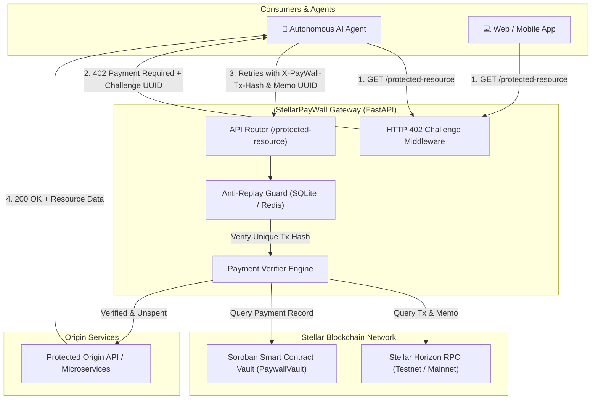
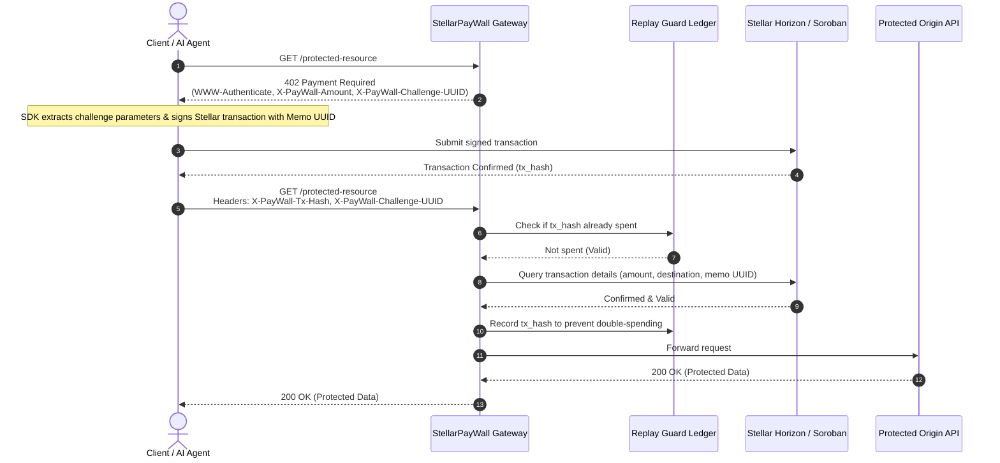

# StellarPayWall

<p align="center">
  <strong>A High-Throughput HTTP 402 Stellar Micropayment API Gateway & Middleware for API Monetization, Agentic Payments, and Soroban Asset Verification.</strong>
</p>

<p align="center">
  <a href="https://stellarpaywall.onrender.com/"></a>
  <a href="https://github.com/HassanKorey/StellarPayWall/actions/workflows/ci.yml"></a>
  <a href="LICENSE"></a>
  <a href="https://www.python.org/"></a>
  <a href="https://soroban.stellar.org/"></a>
  <a href="tests/"></a>
</p>

---

## 🌐 Live Deployment on Render

StellarPayWall is deployed live on Render as a high-performance production API Gateway serving the merchant dashboard, interactive API documentation, and live HTTP 402 payment challenge endpoints.

| Resource | Live URL | Description |
| :--- | :--- | :--- |
| **Merchant Dashboard** | [https://stellarpaywall.onrender.com/](https://stellarpaywall.onrender.com/) | Live merchant overview, revenue telemetry, and API key management |
| **Interactive Swagger Docs** | [https://stellarpaywall.onrender.com/docs](https://stellarpaywall.onrender.com/docs) | Interactive OpenAPI 3.0 documentation & live endpoint testing |
| **ReDoc Reference** | [https://stellarpaywall.onrender.com/redoc](https://stellarpaywall.onrender.com/redoc) | Clean developer API reference manual |
| **Health Check Probe** | [https://stellarpaywall.onrender.com/health](https://stellarpaywall.onrender.com/health) | Uptime & container readiness probe (`{"status":"ok"}`) |
| **Protected Resource (402 Demo)** | [https://stellarpaywall.onrender.com/protected-resource](https://stellarpaywall.onrender.com/protected-resource) | Live HTTP 402 challenge testing endpoint |

### Test the Live HTTP 402 Gateway via CLI

You can immediately observe the HTTP 402 payment protocol in action:

```bash
# Requesting a protected resource without payment triggers an HTTP 402 challenge
curl -i https://stellarpaywall.onrender.com/protected-resource
```

**Live Response:**
```http
HTTP/2 402 Payment Required
content-type: application/json
www-authenticate: Stellar asset="XLM", amount="0.05", destination="merchant_address", challenge="a1b2c3d4-..."
x-paywall-amount: 0.05
x-paywall-asset: XLM
x-paywall-destination: merchant_address
x-paywall-challenge-uuid: a1b2c3d4-...

{"detail":"Payment Required"}
```

---

## 💡 Executive Summary & Ecosystem Value

Modern distributed architectures and autonomous **AI agent networks** rely on microservices to exchange compute and data. Traditional payment gateways impose prohibitive fees (typically $0.30 + 2.9%), high minimum thresholds, and multi-day settlement cycles that make per-request micropayments ($0.001 - $0.05) impossible.

**StellarPayWall** operationalizes the native Web standard **HTTP 402 ("Payment Required")** using the Stellar blockchain and Soroban smart contracts:
- **Near-Zero Fees**: Less than 0.00001 XLM (10 Stroops) per payment operation.
- **Sub-5-Second Finality**: Immediate settlement on the Stellar ledger.
- **Soroban Smart Contract Vaults**: On-chain verification for Soroban Asset Contract (SAC) tokens such as USDC and custom assets.
- **Zero-Friction AI Commerce**: Autonomous agents consume paywalled APIs programmatically using lightweight client SDKs that intercept 402 challenges, sign micro-transactions, and resume execution without manual user intervention.

---

## 🏛️ System Architecture

StellarPayWall sits in front of protected origin APIs as a reverse proxy or middleware layer.



### HTTP 402 Protocol Sequence



---

## 🔒 Soroban Smart Contract (`PaywallVault`)

The repository includes a production-ready Soroban smart contract located in [`contracts/paywall_vault/`](contracts/paywall_vault/):

- **`initialize(admin: Address, token: Address)`**: Configures vault ownership and accepted payment token (e.g., SAC USDC or native XLM).
- **`pay_for_resource(payer: Address, request_id: Symbol, amount: i128)`**: Atomically transfers tokens to the vault, records payment metadata, and emits a `PaymentVerified` event indexed by request UUID.
- **`claim_merchant_balance(merchant: Address, amount: i128)`**: Allows the merchant administrator to withdraw accumulated revenue.
- **`get_payment_status(request_id: Symbol)`**: On-chain lookup returning payment timestamp, amount, and payer address.

### Contract Test Suite
```bash
cd contracts/paywall_vault
cargo test
cargo clippy -- -D warnings
```
All contract test cases (`test_full_paywall_vault_lifecycle`, `test_duplicate_payment_rejection`, `test_invalid_amount_rejection`) pass with zero clippy warnings.

---

## 📦 Client SDKs

StellarPayWall provides lightweight client SDKs that automatically intercept HTTP 402 challenges, construct & sign the required payment transactions, and transparently retry the request.

### Python SDK (`sdks/python/stellarpaywall_sdk`)

```python
from stellarpaywall_sdk import StellarPaywallClient

# Initialize client with Gateway URL and merchant/agent credentials
client = StellarPaywallClient(
    base_url="https://stellarpaywall.onrender.com",
    secret_key="S...",  # Agent Stellar Secret Key
    horizon_url="https://horizon-testnet.stellar.org",
)

# Automatically handles 402 interception, transaction signing, and retry!
response = client.get("/protected-resource")

if response.status_code == 200:
    print("Resource unlocked:", response.json())
else:
    print("Failed:", response.status_code, response.text)
```

### TypeScript / JavaScript SDK (`sdks/typescript`)

```typescript
import { StellarPaywallClient } from "stellarpaywall-sdk";

const client = new StellarPaywallClient({
  baseUrl: "https://stellarpaywall.onrender.com",
  secretKey: "S...",
  horizonUrl: "https://horizon-testnet.stellar.org"
});

// fetch() seamlessly handles the 402 negotiation
const response = await client.fetch("/protected-resource");
const data = await response.json();
console.log("Premium Data:", data);
```

---

## 🛡️ Security & Anti-Replay Architecture

To prevent transaction reuse and payment spoofing, StellarPayWall incorporates strict security controls:

1. **Cryptographic Challenge UUID**: Every 402 challenge generates a cryptographically random UUID that the payer must include in the Stellar transaction memo.
2. **Replay Ledger**: Transaction hashes are atomically recorded in an indexed SQLite/Redis ledger (`stellar_replay.db`). Replayed hashes are immediately rejected with `400 Bad Request: Transaction already spent`.
3. **Exact Asset & Threshold Enforcement**: Validates that payments match the requested asset (XLM or SAC token) and meet or exceed the required price.
4. **Security Regression Suite**: [`tests/test_security_vectors.py`](tests/test_security_vectors.py) enforces 100% test passing against replay attacks, underpaid amounts, wrong asset codes, and mismatched memo UUIDs.

---

## 🛠️ Local Development & Quickstart

### Prerequisites
- **Python 3.11+**
- **Rust & Cargo** with `wasm32-unknown-unknown` target (for Soroban contracts)
- **Docker & Docker Compose** (optional, for Redis/Postgres)

### 1. Clone the Repository
```bash
git clone https://github.com/HassanKorey/StellarPayWall.git
cd StellarPayWall
```

### 2. Setup Python Virtual Environment
```bash
python3 -m venv venv
source venv/bin/activate
pip install --upgrade pip
pip install -r requirements.txt
```

### 3. Run the Development Server
```bash
uvicorn stellarpaywall.main:app --reload --host 0.0.0.0 --port 8000
```
Visit the local dashboard at `http://localhost:8000/` and interactive docs at `http://localhost:8000/docs`.

### 4. Run the Full Test & Lint Suite
```bash
# Run Python Unit & Security Vector Tests
pytest tests/ -v

# Run Soroban Smart Contract Tests
cd contracts/paywall_vault
cargo test
cd ../..

# Run Ruff Code Quality Linter
ruff check .
```

---

## ☁️ Render Deployment Blueprint

The repository includes a ready-to-deploy [`render.yaml`](render.yaml) blueprint:

```yaml
services:
  - type: web
    name: stellarpaywall
    runtime: python
    buildCommand: pip install -r requirements.txt
    startCommand: uvicorn stellarpaywall.main:app --host 0.0.0.0 --port $PORT
    healthCheckPath: /health
    autoDeploy: true
    envVars:
      - key: PYTHON_VERSION
        value: 3.11.9
      - key: STELLAR_NETWORK
        value: TESTNET
      - key: STELLAR_REPLAY_DB_PATH
        value: /tmp/stellar_replay.db
```

To deploy your own instance:
1. Connect your GitHub repository to [Render](https://render.com).
2. Select **New Blueprint Instance** and point to `render.yaml`.
3. Render automatically builds the dependencies, runs the uvicorn service, and monitors the `/health` endpoint.

---

## 🏆 Drips Wave 10 Governance & Issue Backlog

StellarPayWall is designed for open-source community contributions under the **Stellar Wave Program**:

- **Governance Documentation**:
  - Maintainers Guide: [`MAINTAINERS.md`](MAINTAINERS.md)
  - Contribution Standards: [`CONTRIBUTING.md`](CONTRIBUTING.md)
  - Security Vulnerability Policy: [`SECURITY.md`](SECURITY.md)
  - License: [`LICENSE`](LICENSE) (MIT)
- **10-Issue Maintainer Backlog**:
  All 10 backlog tasks are documented in [`drips-issues/WAVE10_ISSUES.md`](drips-issues/WAVE10_ISSUES.md) and mapped to official complexity tiers:
  - **Trivial (100 Points)**: Issues #1, #2 (OpenAPI docstrings, Horizon backoff retry)
  - **Medium (150 Points)**: Issues #3, #4, #5, #6 (Horizon verifier, Redis ledger, Integration tests, Next.js analytics)
  - **High (200 Points)**: Issues #7, #8, #9, #10 (Dynamic price estimator, SAC token verifier, Multi-language SDKs, CI/CD coverage)
- **CI/CD Enforcement**:
  Every Pull Request is validated by [`.github/workflows/ci.yml`](.github/workflows/ci.yml) against both Python and Soroban smart contract checks under branch protection rulesets.

---

## 📄 License

This project is licensed under the [MIT License](LICENSE).
